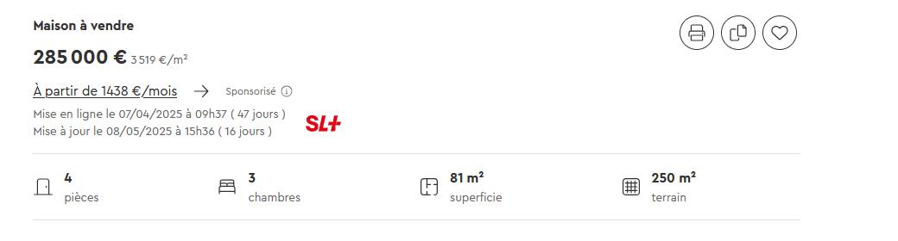

#  SeLoger Plus 

## Description

🇫🇷 Ce code vous permet de voir la date de mise en ligne de l'annonce ainsi que sa date de modification

----

🇺🇸 This code allows you to see the date the ad was put online, as well as the date it was modified.

## Addon Page

 
<!--  -->

## Captures d'écran

## Mes autres extensions

- [ Item Price History - LeBonCoin](https://github.com/OptiPanda/lbc_old_price)